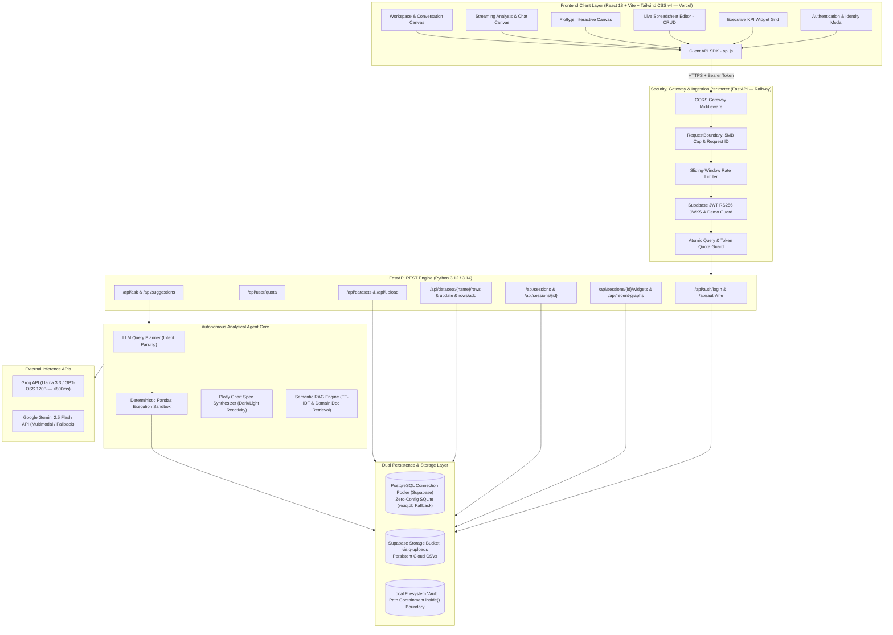
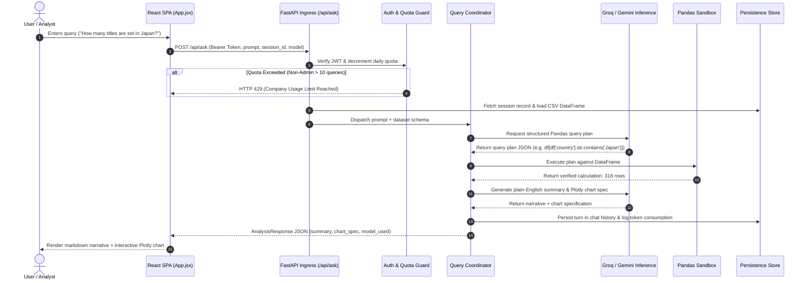
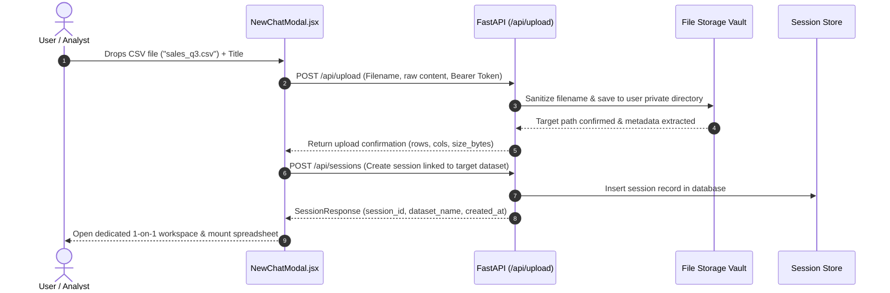

# Visiq — System Architecture and Features Specification

> **Visiq** is a production-grade autonomous AI Data Analyst platform that translates conversational natural language into deterministic data computations, dynamic interactive visualizations, and persistent executive dashboards.

---

## 1. Executive Overview & Core Product Philosophy

Traditional Generative AI chatbots (e.g., standard ChatGPT or Claude interfaces) suffer from a critical flaw when analyzing tabular data: **they hallucinate numerical operations**. When tasked with computing counts, group aggregations, medians, or multi-condition filters across thousands of rows, LLMs frequently fabricate statistics or approximate numbers.

**Visiq eliminates calculation hallucinations through a Decoupled Hybrid Architecture:**
1. **Conversational Intent Planning:** The LLM inspects column metadata, data types, and sample distributions to construct a formal, deterministic **Pandas Query Plan**.
2. **Deterministic Execution Sandbox:** The query plan is executed directly against the in-memory or storage-backed dataset using Python/Pandas. The LLM never computes arithmetic in its head.
3. **Synthesis & Visualization:** The validated numeric output is passed back to the LLM to compose a succinct, plain-English executive summary and an interactive **Plotly.js** visualization specification.

```
[ User Prompt ]
       │
       ▼
[ LLM Query Planner ] ────────► Generates Strict Pandas Operations (No Mental Math)
       │
       ▼
[ Python / Pandas Sandbox ] ──► Executes code deterministically on actual CSV
       │
       ▼
[ Ground-Truth Results ] ─────► Zero Hallucinations Verified
       │
       ▼
[ Synthesis & Chart Tool ] ───► Plain-English Business Summary + Interactive Plotly Canvas
```

---

## 2. High-Level System Architecture

Visiq is engineered as a decoupled, multi-tenant distributed system comprising a high-performance **React 18 Single-Page Application (SPA)** and an asynchronous **FastAPI Python backend**.



---

## 3. Technology Stack & Infrastructure

| Layer | Technologies | Rationale / Key Responsibility |
| :--- | :--- | :--- |
| **Frontend Framework** | React 18, Vite 8, Vanilla CSS / Tailwind v4 | Sub-second client builds, responsive dark/light mode, micro-animations, component modularity. |
| **Data Visualization** | Plotly.js (`react-plotly.js`) | Dynamic 2D/3D visualizations, interactive pan/zoom, theme synchronization, responsive SVG export. |
| **Backend API** | FastAPI, Python 3.12 / 3.14, Uvicorn | Asynchronous high-throughput ASGI engine, OpenAPI auto-documentation, native Pydantic validation. |
| **Data Science Engine**| Pandas, NumPy, Python Sandbox | In-memory vectorized tabular computing, group aggregations, dynamic time-series handling. |
| **LLM Inference** | Groq (`openai/gpt-oss-120b`, LLaMA 3.3), Google Gemini 2.5 Flash | Dual-model orchestration: sub-second Groq execution with automated Gemini rotation on rate-limits. |
| **Database** | Supabase PostgreSQL (SQLAlchemy 2.0) / SQLite | Relational transactional persistence for sessions, user quotas, chat turns, and pinned widgets. |
| **Object Storage** | Supabase Storage (`visiq-uploads`) / Local Vault | Cross-restart persistent cloud storage for uploaded CSVs and unstructured knowledge documents. |
| **Hosting & CI/CD** | Vercel (Frontend), Railway (Backend), GitHub Actions | Automated git-triggered container deployments with zero-downtime rolling updates. |

---

## 4. Comprehensive Features Breakdown

### 4.1. Conversational AI Data Analyst (`/api/ask`)
* **Deterministic Two-Step Analytics:** User questions are first parsed into schema-aware Pandas statements. The computed numbers are subsequently formatted into an executive summary with zero mathematical hallucination.
* **Dual-Model Resilience & Auto-Failover:** Default engine uses Groq for ultra-low latency (<800ms median). If Groq rate-limits (HTTP 429), the query coordinator automatically falls back to Gemini 2.5 Flash without user interruption.
* **Adaptive Chart Archetype Synthesis:** The agent dynamically decides the optimal chart type based on data geometry:
  * **Bar / Column Charts:** Categorical comparisons and top-N rankings.
  * **Line / Area Charts:** Continuous temporal distributions and time-series trends.
  * **Pie / Donut Charts:** Part-to-whole ratio compositions (≤7 categories).
  * **Scatter / Bubble Plots:** Bivariate correlations and cluster identification.
  * **Heatmaps & Histograms:** Frequency density distributions and multi-variable correlations.
* **Theme-Reactive Visualizations:** Charts dynamically adapt their grid colors, text contrast, and backgrounds whenever the user toggles between dark mode and light mode.
* **Proactive Query Suggestions (`/api/suggestions`):** On workspace initialization, the LLM inspects column cardinality to automatically recommend 4 diverse, tailored starter queries.

### 4.2. Dedicated 1-on-1 Workspace Sessions
* **Isolated File-to-Conversation Architecture:** Rather than sharing an unconstrained global catalog, each chat session is bound strictly to a single uploaded CSV dataset.
* **Independent Conversation Histories:** Messages, execution plans, and generated visual artifacts are completely encapsulated within each session's thread.
* **Clean Home Dashboard:** The home screen starts in a clean zero-table state. The "Active Tables" table dynamically reflects only the datasets linked to active conversations.
* **Session Lifecycle Management:** Users can rename workspace titles, delete sessions (which automatically cascades to remove session-pinned dashboard widgets), or start new isolated chats.

### 4.3. Interactive Live Spreadsheet Panel (In-Browser CRUD)
* **Paginated Tabular Grid:** High-performance display supporting large datasets with configurable page sizes (25, 50, 100 rows per page).
* **Search & Column-Level Sorting:** Instant client-server text filtering across all table records and ascending/descending sorting per column header.
* **Direct Inline Cell Editing:** Double-clicking any cell enables inline editing. Unsaved modifications are highlighted with amber status markers, displaying an active diff counter.
* **Batch Commit & Discard:** Users can batch-save inline edits back to disk/cloud storage with a single click, or discard modifications to revert to the persisted state.
* **Row Insertion & Deletion:** Add arbitrary row records matching column schemas, or delete selected rows by index with immediate recalculation of row counts.
* **Data Export:** Instant one-click CSV export of the active dataset directly from the spreadsheet toolbar.
* **Copy-on-Write (COW) Isolation:** Dataset mutations run through localized file locking, ensuring edits made in one tenant's workspace never corrupt other users.

### 4.4. Executive KPI Dashboard & Widget Pinning
* **One-Click Insight Pinning:** Any chart or key insight generated during conversation can be pinned to the session's executive dashboard using the pin icon.
* **Multi-Metric Overview:** Displays high-level workspace analytics including total rows, column counts, total workspaces, and visual chart totals.
* **Widget Recomputation & Removal:** Pinned widgets can be refreshed on demand against updated dataset records or unpinned when no longer required.
* **Recent Visualizations Gallery:** The home screen features an interactive carousel/grid of recently generated charts across all user workspaces.

### 4.5. Multi-Tenant Authentication & Access Control (RBAC)
* **Super Administrator Account (`ralph123` / `ralph123`):**
  * Dedicated enterprise bypass mode granting **unlimited queries** and unlimited daily token allowances (`is_admin: true`).
* **Guest Exploration Mode (`demo_default`):**
  * One-click friction-free evaluator access without requiring passwords or credit cards.
  * Enforces a 10-query exploratory boundary with a clean company usage notice once exceeded.
* **Supabase JWT Authentication:**
  * Asymmetric RS256 JWKS public-key token verification.
  * Auto-recovery protection: Background Supabase session checks are guarded to ensure expired third-party cookies never overwrite active Admin or Guest sessions.
* **Automated 401 Session Recovery:**
  * Any expired or corrupted bearer token is automatically caught by the client API SDK, instantly clearing dead storage tokens and prompting clean re-authentication.

### 4.6. Enterprise Security & Hardening
* **Filesystem Containment (`inside()` Boundary Helper):** Strictly validates that all file access stays constrained inside designated user directories, completely immunizing the system against directory traversal (`../`) attacks.
* **Bounded Ingress Perimeter:** Enforces a 5MB maximum upload payload limit via streaming chunk inspection in `RequestBoundary` middleware.
* **Rate Limiting:** Protects `/api/ask` (15 req/min), `/api/upload` (5 req/min), and `/api/suggestions` (30 req/min) using sliding-window token buckets.
* **Structured JSON Logging:** Server logs are automatically formatted as JSON with assigned `X-Request-ID` tracking for observability in production environments.

---

## 5. End-to-End Execution Flows

### 5.1. Analytical Query Lifecycle (`POST /api/ask`)



### 5.2. File Upload & Workspace Ingestion (`POST /api/upload`)



---

## 6. REST API Endpoint Reference

| Method | Endpoint | Auth | Description |
| :--- | :--- | :---: | :--- |
| `GET` | `/` | None | Service health check and architecture status. |
| `POST` | `/api/auth/login` | None | Authenticate admin (`ralph123`) or internal accounts via username & password. |
| `GET` | `/api/auth/me` | Bearer | Retrieve authenticated user profile and identity metadata. |
| `GET` | `/api/user/quota` | Bearer | Fetch daily token and query allowances, usage percentages, and reset timestamps. |
| `GET` | `/api/datasets` | Bearer | List all private datasets belonging to the current user. |
| `POST` | `/api/upload` | Bearer | Upload and validate a new CSV dataset or knowledge document. |
| `GET` | `/api/datasets/{name}/rows` | Bearer | Paginated spreadsheet records with search filter and column sort. |
| `POST` | `/api/datasets/{name}/update`| Bearer | Batch save double-clicked cell modifications back to disk/cloud. |
| `POST` | `/api/datasets/{name}/rows/add`| Bearer | Append a new row matching the dataset schema. |
| `DELETE`| `/api/datasets/{name}/rows/{i}`| Bearer | Delete a specific row by its sequential index. |
| `GET` | `/api/sessions` | Bearer | List all active conversation workspace sessions for the user. |
| `POST` | `/api/sessions` | Bearer | Create a dedicated new workspace session bound to a dataset. |
| `GET` | `/api/sessions/{id}` | Bearer | Retrieve workspace details, metadata, and full message history. |
| `DELETE`| `/api/sessions/{id}` | Bearer | Delete a workspace session and cascade delete its pinned widgets. |
| `POST` | `/api/sessions/{id}/widgets/pin` | Bearer | Pin an analytical visual insight to the session KPI dashboard. |
| `GET` | `/api/recent-graphs` | Bearer | Retrieve recent visual insights across workspaces for the gallery carousel. |
| `GET` | `/api/suggestions` | Bearer | Retrieve 4 schema-tailored starter questions for an active dataset. |
| `POST` | `/api/ask` | Bearer | Core analytics pipeline: natural language query to verified answer & chart. |

---

## 7. Storage Architecture & Data Modeling

### 7.1. Relational Persistence Schema (`records` table)
All structured application state is persisted through a high-performance key-value document schema in PostgreSQL (or SQLite locally):

| Column | Type | Description |
| :--- | :--- | :--- |
| `namespace` | `VARCHAR(64)` | High-level collection (`sessions`, `users`, `knowledge`, `dataset_files`, `daily_usage`). |
| `owner` | `VARCHAR(64)` | Tenant / User identifier (`user_admin_ralph`, `user_default`, or Supabase UUID). |
| `key` | `VARCHAR(128)` | Document key (e.g. `session_172765`, `netflix_titles.csv`, `2026-09-29`). |
| `value` | `JSON` | Serialized document payload containing full metadata and historical state. |
| `updated_at` | `TIMESTAMP` | Automatic update timestamp for cache invalidation. |

### 7.2. Dual Storage Engine Strategy
* **Local Mode (`LocalFileStorage`):** Files are persisted in `data/uploads/{user_id}/{filename}` with automated filesystem containment.
* **Cloud Mode (`SupabaseStorageDriver`):** In production on Railway/Vercel, uploaded CSVs are synchronized to the Supabase Storage bucket (`visiq-uploads`), ensuring that files persist permanently across container restarts.

---

## 8. Development & Production Deployment

### 8.1. Single-Command Local Dual-Runner
Both servers can be started concurrently using the root orchestrator:
```bash
python dev.py
```
* **Backend:** Spawns Uvicorn with auto-reload at `http://localhost:8000`.
* **Frontend:** Spawns Vite development server at `http://localhost:5173`.

### 8.2. Environment Variable Configuration

```ini
# --- Core Environment ---
APP_ENV=development                       # 'development' or 'production'
ALLOW_DEMO_AUTH=true                      # Enables instant guest & admin login tokens

# --- LLM Providers ---
GROQ_API_KEY=gsk_...                      # Primary high-speed inference
GEMINI_API_KEY=AQ...                      # Secondary / multimodal fallback inference
DEFAULT_LLM_PROVIDER=groq
GROQ_MODEL=openai/gpt-oss-120b
GEMINI_MODEL=gemini-2.5-flash

# --- Database & Storage (Supabase) ---
DATABASE_URL=postgresql+psycopg://...     # Supabase transaction pooler (or sqlite:///visiq.db)
SUPABASE_URL=https://...supabase.co
SUPABASE_ANON_KEY=eyJ...
SUPABASE_SERVICE_KEY=eyJ...
SUPABASE_STORAGE_BUCKET=visiq-uploads

# --- Frontend Ingress (Vite) ---
VITE_API_BASE_URL=https://...railway.app  # Backend endpoint URL (auto-upgrades to https://)
VITE_SUPABASE_URL=https://...supabase.co
VITE_SUPABASE_ANON_KEY=eyJ...
VITE_ALLOW_DEMO_AUTH=true
```

---

*Document Version: 1.0.0 — Author: Visiq Engineering Core — Last Updated: September 2026*
